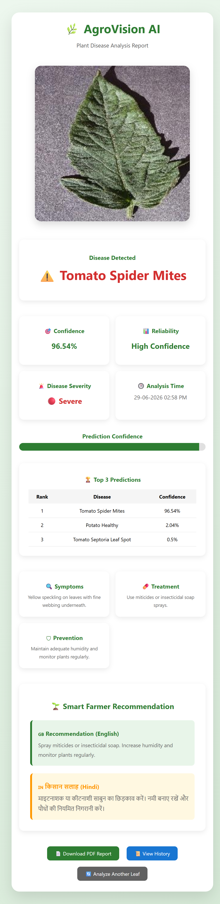
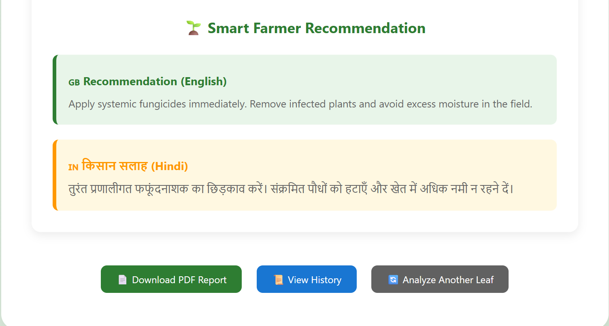
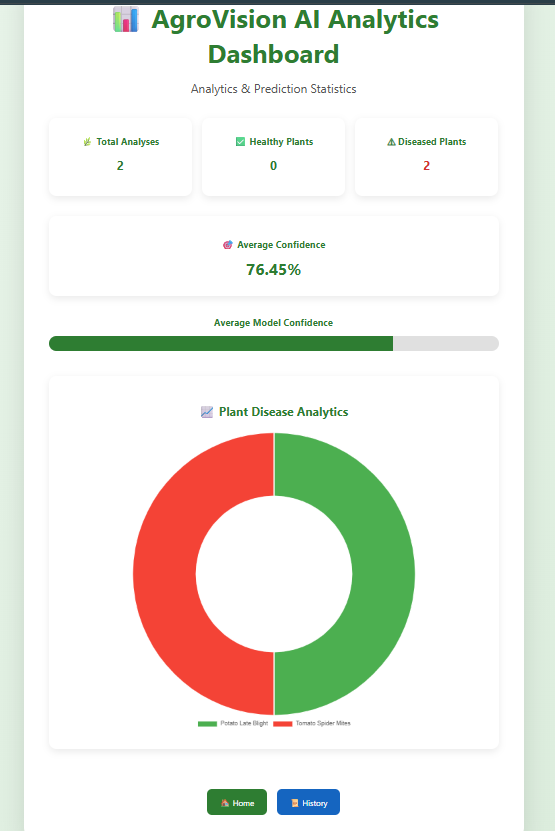
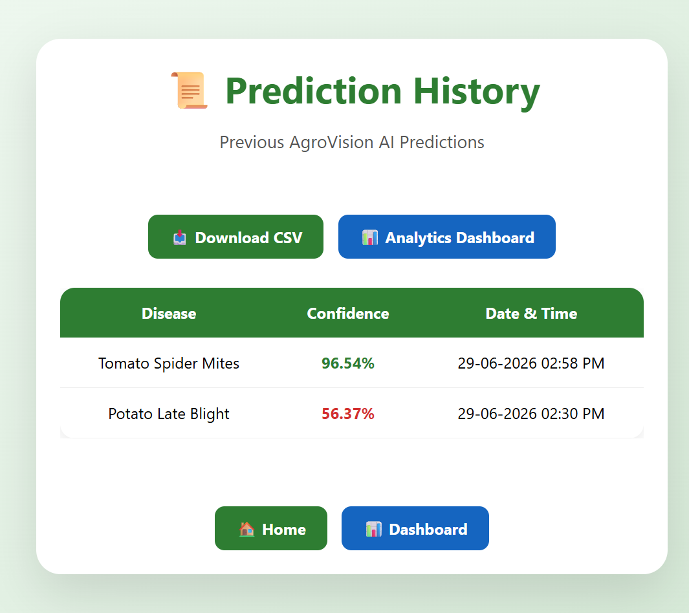

# 🌿 AgroVision AI

### AI-Powered Plant Disease Detection System using Deep Learning, TensorFlow, Flask and Computer Vision

AgroVision AI is an intelligent web-based plant disease detection system that uses a Convolutional Neural Network (CNN) to identify diseases from leaf images. The application provides disease prediction, confidence score, severity estimation, symptoms, treatment recommendations, prevention tips, AI-powered farmer recommendations (English & Hindi), prediction history, downloadable reports, and an analytics dashboard.

---

## 🚀 Live Demo

🔗 https://agrovision-ai-7ovf.onrender.com

---

## 📌 Project Highlights

- 🌱 Deep Learning based Plant Disease Detection
- 🧠 CNN Model trained using TensorFlow & Keras
- 📷 Image Upload and Real-Time Prediction
- 📊 Interactive Analytics Dashboard
- 📈 Confidence Score Visualization
- 🚨 Disease Severity Estimation
- 🌿 Smart Farmer Recommendation Engine
- 🇮🇳 Hindi Recommendation Support
- 📄 PDF Report Generation
- 📜 Prediction History
- 📥 CSV Export
- 🗄 SQLite Database Integration
- 💻 Responsive Flask Web Application

## 📖 Project Overview

AgroVision AI is an end-to-end Artificial Intelligence based web application designed to assist farmers, agricultural researchers, and students in identifying plant diseases from leaf images.

The system leverages a Convolutional Neural Network (CNN) trained on the PlantVillage dataset to classify diseases affecting Tomato, Potato, and Bell Pepper plants with high accuracy.

After a user uploads a leaf image, the application performs the following tasks:

* Detects the plant disease
* Calculates prediction confidence
* Estimates disease severity
* Displays the top 3 predicted diseases
* Provides symptoms, treatment, and prevention methods
* Generates AI-powered farmer recommendations in both English and Hindi
* Saves every prediction to a SQLite database
* Displays analytics through an interactive dashboard
* Allows downloading prediction reports as PDF and CSV

The application is built using Flask for the backend, TensorFlow/Keras for deep learning, SQLite for data storage, and Chart.js for interactive analytics.

---

## 🎯 Objectives

* Detect plant diseases accurately using Deep Learning.
* Reduce manual disease diagnosis.
* Assist farmers with treatment recommendations.
* Provide bilingual (English & Hindi) guidance.
* Maintain prediction history and analytics.
* Generate downloadable reports for future reference.

## ✨ Features

| Feature                        | Description                                                               |
| ------------------------------ | ------------------------------------------------------------------------- |
| 🌿 Plant Disease Detection     | Detects diseases from uploaded leaf images using a trained CNN model.     |
| 🎯 Confidence Score            | Displays the prediction confidence percentage.                            |
| 🚨 Disease Severity            | Categorizes detected diseases as Mild, Moderate, or Severe.               |
| 🏆 Top 3 Predictions           | Shows the three most probable disease predictions with confidence scores. |
| 🔍 Disease Information         | Displays symptoms, treatment methods, and prevention tips.                |
| 🌱 Smart Farmer Recommendation | Provides AI-powered recommendations for disease management.               |
| 🇮🇳 Hindi Recommendation      | Displays farmer recommendations in Hindi for better accessibility.        |
| 📊 Analytics Dashboard         | Visualizes prediction statistics using interactive charts.                |
| 📜 Prediction History          | Stores previous predictions in a SQLite database.                         |
| 📄 PDF Report                  | Generates a downloadable PDF report for every prediction.                 |
| 📥 CSV Export                  | Allows downloading the complete prediction history in CSV format.         |
| 💾 SQLite Database             | Stores disease, confidence, image path, and analysis time.                |
| 🌐 Flask Web Application       | Responsive web interface built using Flask.                               |
| ⚡ Real-Time Prediction         | Generates predictions within a few seconds after image upload.            |

## 🌱 Supported Plants

* 🍅 Tomato
* 🥔 Potato
* 🫑 Bell Pepper

---

## 🍃 Supported Diseases

### Tomato

* Healthy
* Bacterial Spot
* Early Blight
* Late Blight
* Leaf Mold
* Septoria Leaf Spot
* Spider Mites
* Target Spot
* Tomato Mosaic Virus
* Tomato Yellow Leaf Curl Virus

### Potato

* Healthy
* Early Blight
* Late Blight

### Bell Pepper

* Healthy
* Bacterial Spot

---

# 🛠 Tech Stack

| Category             | Technology                         |
| -------------------- | ---------------------------------- |
| Programming Language | Python 3.11                        |
| Backend Framework    | Flask                              |
| Machine Learning     | TensorFlow                         |
| Deep Learning        | Keras                              |
| Neural Network       | Convolutional Neural Network (CNN) |
| Computer Vision      | OpenCV                             |
| Numerical Computing  | NumPy                              |
| Database             | SQLite                             |
| Frontend             | HTML5, CSS3, JavaScript            |
| Charts               | Chart.js                           |
| PDF Generation       | ReportLab                          |
| Deployment           | Render                             |
| Version Control      | Git & GitHub                       |

# 📂 Project Structure

```text
AgroVision-AI/
│
├── model/
│   └── agrovision_best_model.h5
│
├── static/
│   ├── css/
│   │   └── style.css
│   └── uploads/
│
├── templates/
│   ├── index.html
│   ├── result.html
│   ├── history.html
│   └── dashboard.html
│
├── screenshots/
│   ├── home.png
│   ├── result.png
│   ├── dashboard.png
│   ├── history.png
│   └── recommendation.png
│
├── Agro_model_train.ipynb
├── app.py
├── predict.py
├── recommendation_engine.py
├── disease_info.py
├── requirements.txt
├── Procfile
├── runtime.txt
├── .render.yaml
└── README.md
```
# 📸 Screenshots

## 🏠 Home Page


---

## 🔍 Disease Prediction Result



---

## 🌱 Smart Farmer Recommendation



---

## 📊 Analytics Dashboard



---

## 📜 Prediction History


