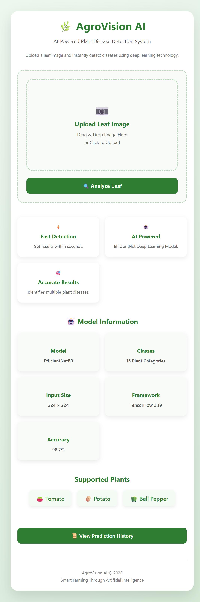
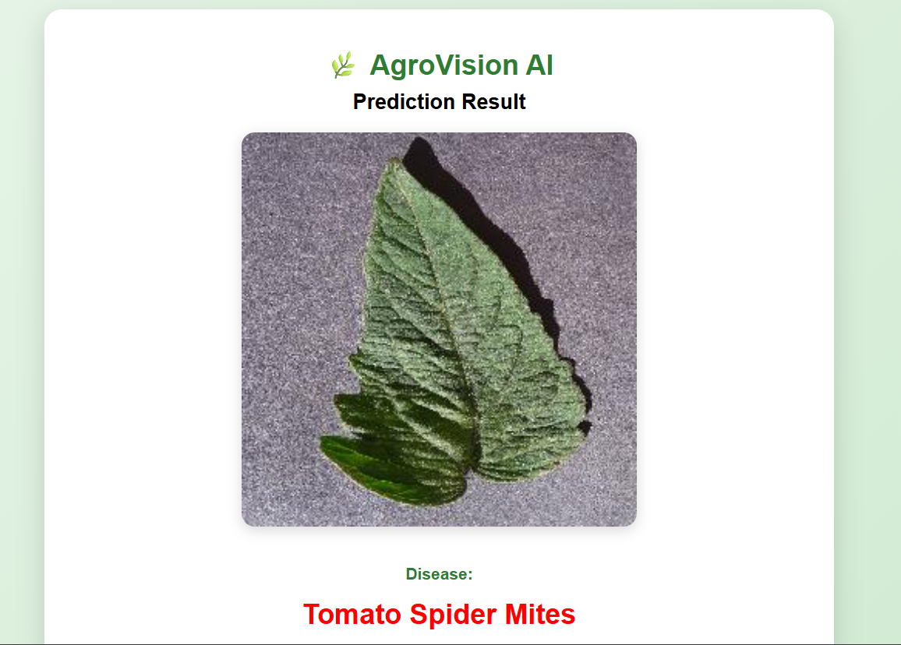
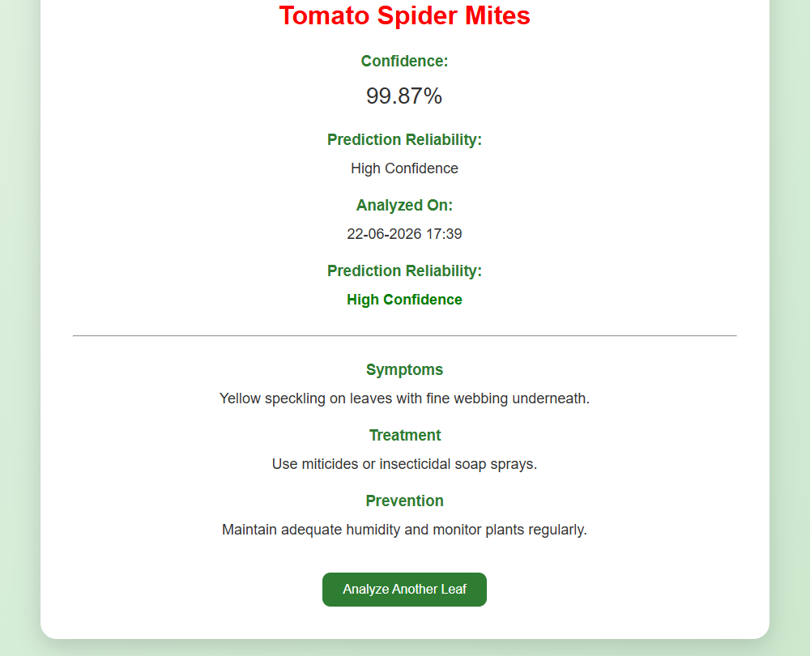
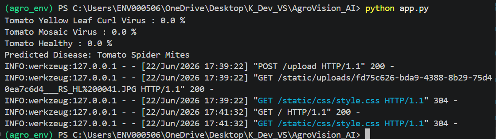

# 🌿 AgroVision AI

AI-Powered Plant Disease Detection System using Deep Learning and Flask.

---

## 📌 Project Overview

AgroVision AI is a web-based plant disease detection system that uses a Convolutional Neural Network (CNN) to identify diseases from plant leaf images.

The system analyzes uploaded leaf images and provides:

- Disease Prediction
- Prediction Confidence
- Symptoms
- Treatment Suggestions
- Prevention Tips

---

## 🚀 Features

✅ Upload leaf images

✅ Deep Learning based disease classification

✅ Confidence score display

✅ Disease information system

✅ Responsive Flask web interface

✅ Real-time prediction

---

## 🌱 Supported Plants

- Tomato
- Potato
- Bell Pepper

---

## 🦠 Supported Diseases

- Early Blight
- Late Blight
- Bacterial Spot
- Leaf Mold
- Septoria Leaf Spot
- Target Spot
- Spider Mites
- Mosaic Virus
- Yellow Leaf Curl Virus
- Healthy Leaves

---

## 🛠 Tech Stack

### Frontend
- HTML
- CSS

### Backend
- Flask (Python)

### Machine Learning
- TensorFlow
- Keras
- CNN

---

## 📂 Project Structure

```text
AgroVision-AI
│
├── app.py
├── predict.py
├── disease_info.py
├── requirements.txt
├── Agro_model_train.ipynb
│
├── model/
│   └── agrovision_best_model.h5
│
├── templates/
│   ├── index.html
│   └── result.html
│
├── static/
│   └── css/
│       └── style.css
│
└── screenshots/
```

## 📸 Screenshots

### Home Page



### Sample Input



### Prediction Result



### Terminal Output



---

## ⚙ Installation

Clone the repository:

```bash
git clone https://github.com/K100-SKETCH/AgroVision-AI.git
```

Install dependencies:

```bash
pip install -r requirements.txt
```

Run application:

```bash
python app.py
```

Open:

```text
http://127.0.0.1:5000
```

---

## 🎯 Future Improvements

- Mobile-friendly UI
- More crop support
- Live camera detection
- Cloud deployment
- Disease severity estimation

---

## 👨‍💻 Author

Kshitij Kumar

B.Tech CSE

Manipal University Jaipur
